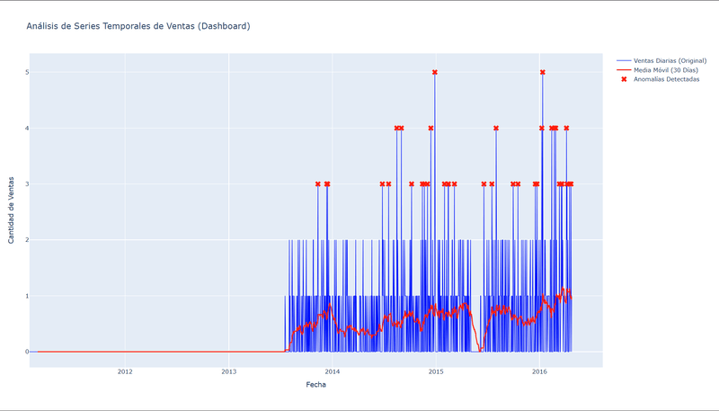
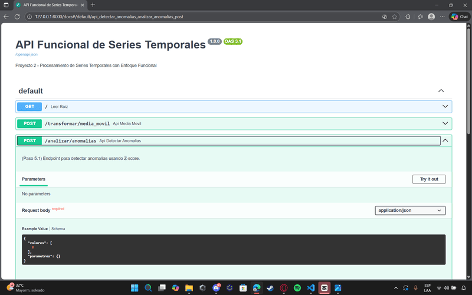
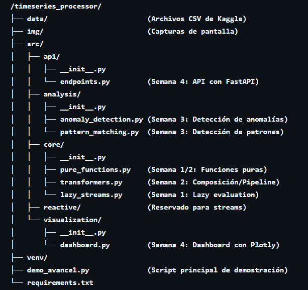

# 📈 Proyecto 2: Procesador de Series Temporales con Enfoque Funcional

### Universidad de Colima - Ingeniería en Computación Inteligente
**Materia:** Programación Funcional  
**Profesor:** Gonzalez Zepeda Sebastian  
**Semestre:** Agosto 2025 - Enero 2026

---

## 📋 Descripción del Proyecto

Sistema funcional que procesa y analiza la serie temporal de ventas del restaurante **"Las Hamacas del Mayor"**. El sistema implementa transformaciones, filtrados y agregaciones (basado en el dataset M5 de Kaggle) manteniendo los principios de funciones puras e inmutabilidad.

---

## 🎥 Presentación del Proyecto

Explicación completa del funcionamiento, arquitectura del código, análisis de datos, API y dashboard:

🔗 **Video en Google Drive:** [https://drive.google.com/file/d/1dt9K-6Jqenr9p7KUwtLUA3E9xqAKwA9D/view?usp=sharing](https://drive.google.com/file/d/1dt9K-6Jqenr9p7KUwtLUA3E9xqAKwA9D/view?usp=sharing)

---

## 🎯 Objetivos

* Implementar **funciones puras** para la transformación de series temporales.
* Aplicar **lazy evaluation** (evaluación perezosa) con generadores para el manejo eficiente de grandes datasets (M5).
* Usar **composición de funciones** para crear pipelines de análisis.
* Aplicar **funciones de orden superior** (`map`, `filter`, `reduce`) en el análisis temporal.
* Utilizar **recursión** para algoritmos de procesamiento.

---

## 🛠️ Tecnologías Utilizadas

* **Lenguaje:** Python 3.11+
* **Paradigma:** Programación Funcional
* **Librerías (`requirements.txt`):**
    * `pandas`: Lectura inicial del CSV y Lazy Evaluation.
    * `numpy`: Cálculos numéricos optimizados.
    * `statsmodels`: Análisis estadístico.
    * `matplotlib` y `plotly`: Visualización de datos interactiva.
    * `fastapi`: Creación de la API RESTful.
    * `uvicorn`: Servidor ASGI para la API.
    * `rx`: Programación reactiva (reservado).

---

## 📦 Instalación y Configuración

### 1. Clonar el repositorio

```bash
git clone https://github.com/sebastiangz/Procesador_de_Series_Temporales_con_Enfoque_Funcional.git
cd Procesador_de_Series_Temporales_con_Enfoque_Funcional
```

### 2. Crear y activar el entorno virtual

```bash
python -m venv venv

# En Windows (PowerShell):
.\venv\Scripts\Activate.ps1

# En Mac/Linux:
source venv/bin/activate
```

### 3. Instalar las dependencias

```bash
pip install -r requirements.txt
```

### ⚠️ 4. Descarga de Datos Requeridos (Kaggle)

Debido al tamaño de los archivos, los datos no se incluyen en el repositorio. Para ejecutar el proyecto, descarga los siguientes archivos y colócalos en la carpeta `/data/`.

| Archivo | Descripción | Enlace |
| :--- | :--- | :--- |
| `calendar.csv` | Información de días, semanas y eventos | [Descargar en Kaggle](https://www.kaggle.com/code/headsortails/back-to-predict-the-future-interactive-m5-eda/input?select=calendar.csv) |
| `sales_train_evaluation.csv` | Histórico de ventas por tienda y producto | [Descargar en Kaggle](https://www.kaggle.com/code/headsortails/back-to-predict-the-future-interactive-m5-eda/input?select=sales_train_evaluation.csv) |

*(Nota: Asegúrate de que el nombre del archivo de ventas coincida con lo que espera el código, por ejemplo `sales_train_validation.csv`, o renómbralo según sea necesario).*

---

## 🚀 Uso del Sistema (Proyecto Final)

El proyecto tiene dos modos de ejecución principales:

### 1. Demo Principal (Genera el Dashboard)
Este script ejecuta el pipeline completo (carga, análisis, detección de anomalías) y genera un dashboard interactivo.

```bash
# Asegúrate de que tu venv esté activado
python demo_avance1.py
```
*El script generará el archivo `reporte_ventas_final.html`. Ábrelo en tu navegador para ver la gráfica interactiva.*

### 2. API Funcional
Inicia un servidor web local que expone los análisis como endpoints.

```bash
# En una terminal separada, activa el venv
uvicorn src.api.endpoints:app --reload
```
* **Panel de Control:** Visita `http://127.0.0.1:8000/docs`
* **Bienvenida:** Visita `http://127.0.0.1:8000`

---

## 📸 Galería del Proyecto

### 1. Dashboard Interactivo
Visualización de ventas reales (azul), tendencia suavizada (rojo) y anomalías detectadas (X).


### 2. API Funcional (Documentación Automática)
Endpoints funcionales probados en Swagger UI mostrando la respuesta JSON de la detección de anomalías.


### 3. Arquitectura del Proyecto
Estructura modular de carpetas (`core`, `analysis`, `visualization`, `api`) siguiendo el flujo del pipeline de datos.


---

## 📂 Estructura del Proyecto

```text
/timeseries_processor/
├── data/                        (Archivos CSV de Kaggle - Ignorados por Git)
├── img/                         (Capturas de pantalla para documentación)
│   ├── Dashboard.png
│   ├── Api.png
│   └── Pipeline.png
├── src/
│   ├── api/
│   │   ├── __init__.py
│   │   └── endpoints.py         (Semana 4: API con FastAPI)
│   ├── analysis/
│   │   ├── __init__.py
│   │   ├── anomaly_detection.py (Semana 3: Detección de anomalías Z-Score)
│   │   └── pattern_matching.py  (Semana 3: Detección de patrones)
│   ├── core/
│   │   ├── __init__.py
│   │   ├── pure_functions.py    (Semana 1/2: Funciones puras matemáticas)
│   │   ├── transformers.py      (Semana 2: Composición/Pipeline)
│   │   └── lazy_streams.py      (Semana 1: Lazy evaluation con Generadores)
│   ├── reactive/                (Reservado para streams en tiempo real)
│   └── visualization/
│       ├── __init__.py
│       └── dashboard.py         (Semana 4: Dashboard con Plotly)
├── venv/
├── demo_avance1.py              (Script principal de demostración)
└── requirements.txt
```

---

## 📈 Pipeline de Desarrollo (100% Completado)

* ✅ **Semana 1: Funciones Básicas de Manipulación**
    * Estructura del proyecto y lectura de datos (`lazy_streams.py`).
    * Operaciones básicas: media móvil, diferenciación (`pure_functions.py`).
* ✅ **Semana 2: Filtros y Transformaciones Complejas**
    * Transformaciones de escala (normalizar).
    * Composición de funciones (`TimeSeriesPipeline`).
    * Optimización con lazy evaluation.
* ✅ **Semana 3: Detección de Anomalías y Patrones**
    * Algoritmos de detección de outliers (`anomaly_detection.py`).
    * Identificación de tendencias (`pattern_matching.py`).
* ✅ **Semana 4: Dashboard y API Funcional**
    * API RESTful (`api/endpoints.py`).
    * Dashboard interactivo (`visualization/dashboard.py`).

---

## 💼 Componente de Emprendimiento

**Aplicación Real:** Sistema de análisis y predicción de ventas para el restaurante "Las Hamacas del Mayor".

**Propuesta de Valor:**
1.  Optimización de inventario para reducir el desperdicio de alimentos.
2.  Detección automática de anomalías en las ventas (ej. caídas por problemas operativos).
3.  Planificación de personal basada en la predicción de demanda por día de la semana.

---

## 📚 Referencias Académicas

1.  **Sprangers, O., De Rijke, M., & Vlachos, M. (2024).** *Efficient and Accurate Forecasting in Large-scale Settings.*
    * Relevancia: Justifica el uso de agregaciones para analizar ventas y encontrar tendencias.
2.  **Ledesma, J., Garcia, M. (2025).** *Real-Time Advertising Data Unification Using Spark and S3.*
    * Relevancia: Respalda el uso de un pipeline funcional para transformar grandes volúmenes de datos.
3.  **Wagner, M. & Neumann, D. (2020).** *Identifying and Responding to Outlier Demand in Revenue Management.*
    * Relevancia: Fundamenta la detección de anomalías con técnicas funcionales.

---

## 👥 Equipo

| Nombre | Email | GitHub |
| :--- | :--- | :--- |
| **Abimael Villamar** | agarcia165@ucol.mx | [@Abimael2012](https://github.com/Abimael2012) |
| **Jesus Fuentes** | Jfuentes15@ucol.mx | [@ChuyFuentes](https://github.com/ChuyFuentes) |
| **Aaron Diaz** | adiaz82@ucol.mx | [@aarondiazurena25-svg](https://github.com/aarondiazurena25-svg) |

---

## 📄 Licencia
Proyecto académico - Universidad de Colima © 2025